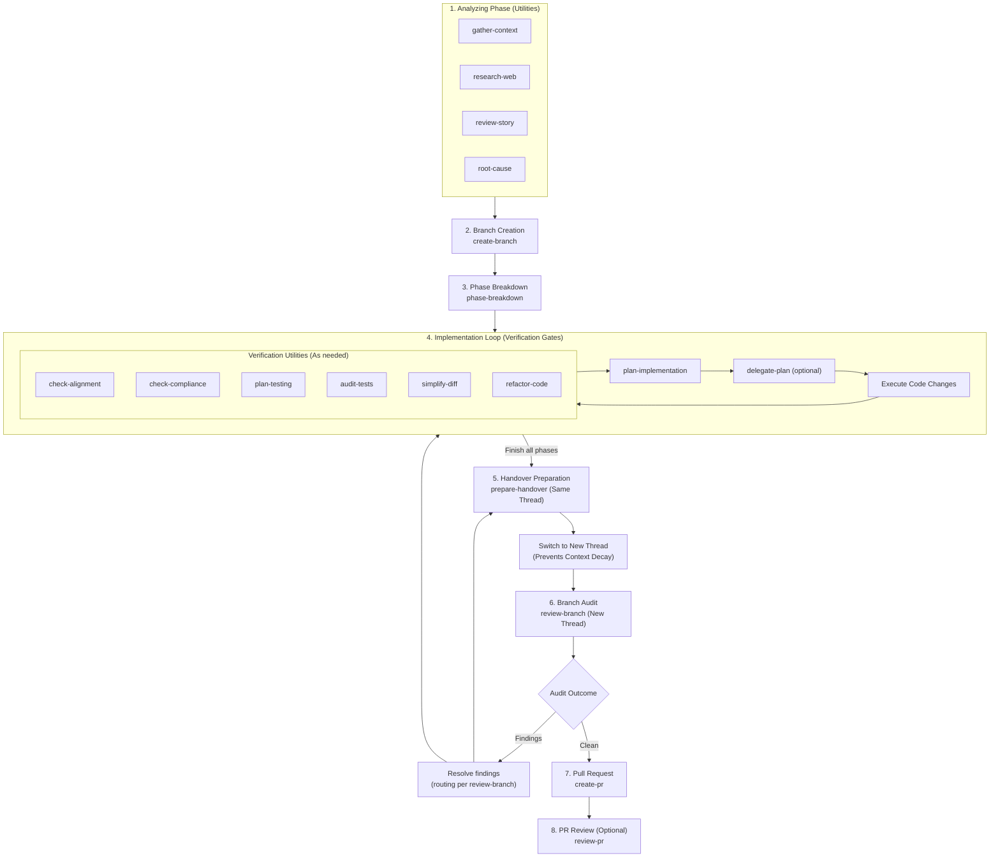

# Agentic Engineering Lifecycle Guide

This guide describes the agentic engineering lifecycle used by this repository. Agentic engineering is professional software delivery through human-directed collaboration with coding agents, supported by explicit context gathering, planning, implementation, verification, review, and release gates.

Rather than relying on a single "one-shot" generation pass, this repository implements a structured, multi-stage pipeline where developers guide intent, approve transitions, and use specialized skills to keep coding-agent work auditable.

---

## 1. Lifecycle Phases

This lifecycle is structured into clear, independent phases to maintain code quality, ensure alignment, and prevent context fatigue.

---

## 2. Deep Dive by Stage

### Stage 1: Analysis (Pre-Coding Utilities)
Before checking out a branch or modifying files, developers use analysis utilities to define requirements and identify system constraints. This gives coding agents the context needed to act deliberately. Developers can select any combination of these utilities depending on the task:

Skill trigger descriptions below match the authoritative frontmatter in each `SKILL.md`; keep them in sync when editing descriptions (see [AGENTS.md](AGENTS.md)).

*   **`gather-context`**: Gather and organize context for a given file, folder, or component before planning or coding. Use when starting work on unfamiliar code.
*   **`research-web`**: Research current best practices and trade-offs from authoritative sources. Use when a decision needs external evidence.
*   **`review-story`**: Audit a user story for gaps, conflicts, and missing detail. Use before planning or implementing a requirement.
*   **`root-cause`**: Investigate an issue to identify its root cause with evidence before proposing fixes. Use when debugging.

### Stage 2: Branching
Once requirements are clear, execute **`create-branch`** to set up a clean Git branch following Conventional Commits formatting rules.

### Stage 3: Phase Breakdown & Planning
For complex changes, do not write code immediately. Planning creates an explicit engineering contract between the developer and the coding agent.
1.  Run **`phase-breakdown`** to divide the work into discrete, incrementally verifiable steps.
2.  For each step in the breakdown, run **`plan-implementation`** to create a reviewable plan outlining the proposed edits.
3.  Optionally run **`delegate-plan`** to produce a handoff prompt so a cheaper model can execute the approved plan in a fresh thread. This reduces cost and gives the executing agent a clean context window focused on implementation. When that agent reports back, run **`check-alignment`** before trusting the result.

### Stage 4: Implementation Loop (Verification Gates)
With the implementation plan established, coding-agent work proceeds through explicit verification gates. During this loop, the developer selects which verification utilities are needed:
*   **`check-alignment`**: Verify that implementation changes match the agreed plan or requirements. Use after implementing a planned change.
*   **`check-compliance`**: Audit changed code against the project's standards and guidelines. Use after changes are written and before review.
*   **`plan-testing`**: Create a risk-based testing plan for a change. Use before writing tests.
*   **`audit-tests`**: Audit an existing test suite for quality anti-patterns and produce a prioritized improvement plan. Use when test quality itself is the subject, not the tests for a specific change.
*   **`simplify-diff`**: Audit the work in flight for over-engineering and unnecessary code, and report the cuts that would shrink the diff. Use when a change is correct but larger than it needs to be.
*   **`refactor-code`**: Audit design problems and apply behavior-preserving cleanup after approval. Use when code needs restructuring without new behavior.

### Stage 5: Handover, Audit, and Release
After implementation completes, run **`prepare-handover`** in the active implementation thread, then switch to a fresh thread for **`review-branch`**, which routes its findings to the thread that should fix them. Blocking findings must be resolved before release.

Once the audit is clean, release proceeds with:
*   **`create-pr`**: Push the current branch and open a pull request with a synthesized title and description. Use when a reviewed branch is ready to submit.
*   **`review-pr`**: Review an open pull request and return a structured verdict. Use when auditing submitted changes.

---

## 3. Thread Switching & Context Decay Mitigation

LLMs experience quality degradation as conversation history grows (context window bloat). To counteract this, these workflows actively manage thread boundaries.

### The Handover Protocol
1.  **Wrap Up Coding**: Complete the changes and run **`prepare-handover`** within the **active implementation thread** to summarize the work and verification details.
2.  **Migrate Threads**: Immediately open a **new conversation thread**.
3.  **Run the Audit**: In the fresh thread, run **`review-branch`** to audit the diff. This guarantees that code review is performed by a model with a clean context window, ensuring high review fidelity.
4.  **Tackle Audit Findings**: Resolve blocking findings before release. **`review-branch`** routes each finding to the thread that should fix it.

---

## 4. Operational Best Practices

### Selective Lesson Distillation (`distill-lessons`)
Captures high-value patterns, solutions, or architectural guidelines and codifies them into the repository documentation.

### Pre-Commit Auditing (`validate-commit`)
Runs linting, compiler validation, and test checks locally.
