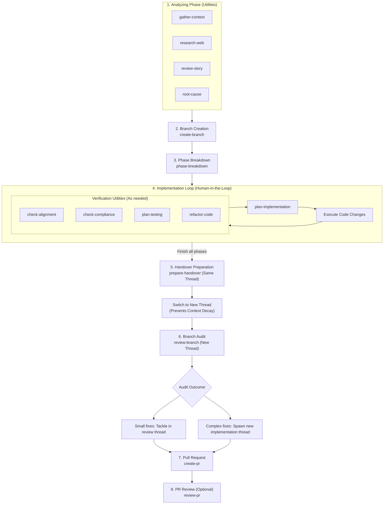

# Developer Agent Workflow Lifecycle Guide

This guide describes the lifecycle of developer agent workflows in this repository. These workflows are designed to be executed as utility rules under developer supervision. The developer serves as the primary conductor, selecting and running individual workflows as needed rather than relying on a rigid, fully automated pipeline.

---

## 1. Lifecycle Phases

The agentic software development lifecycle (SDLC) is structured into clear, independent phases to maintain code quality, ensure alignment, and prevent context fatigue.

---

## 2. Deep Dive by Stage

### Stage 1: Analysis (Pre-Coding Utilities)
Before checking out a branch or modifying files, developers use analysis utilities to define requirements and identify system constraints. Developers can select any combination of these utilities depending on the task:
*   **`gather-context`**: Explores directory structures, configurations, and system boundaries.
*   **`research-web`**: Conducts lookup for modern standards and technical trade-offs.
*   **`review-story`**: Performs logic and sanity-checking checks on user stories.
*   **`root-cause`**: Gathers evidence to debug existing issues without rushing into solutions.

### Stage 2: Branching
Once requirements are clear, execute **`create-branch`** to set up a clean Git branch following Conventional Commits formatting rules.

### Stage 3: Phase Breakdown & Planning
For complex changes, do not write code immediately.
1.  Run **`phase-breakdown`** to divide the work into discrete, incrementally verifiable steps.
2.  For each step in the breakdown, run **`plan-implementation`** to create an `implementation_plan.md` outlining the proposed edits.

### Stage 4: Implementation Loop (Human-in-the-Loop)
With the implementation plan established, the developer writes code. During this loop, the developer selects which verification utilities are needed:
*   **`check-alignment`**: Verifies that actual edits are strictly aligned with the plan.
*   **`check-compliance`**: Runs automated project-specific checks and standards audits.
*   **`plan-testing`**: Details testing sequences.
*   **`refactor-code`**: Refines code cleanly without changing system behavior.

---

## 3. Thread Switching & Context Decay Mitigation

Large language models experience quality degradation as conversation history grows (context window bloat). To counteract this, developers must actively manage thread boundaries.

### The Handover Protocol
1.  **Wrap Up Coding**: Complete the changes and run **`prepare-handover`** within the **active implementation thread** to summarize the work and verification details.
2.  **Migrate Threads**: Immediately open a **new conversation thread**.
3.  **Run the Audit**: In the fresh thread, run **`review-branch`** to audit the diff. This guarantees that code review is performed by a model with a clean context window, ensuring high review fidelity.
4.  **Tackle Audit Findings**:
    *   *Small Issues*: Fix them directly in the review thread.
    *   *Major Issues*: Close the thread and spawn a new implementation thread to isolate the complex edits.

---

## 4. Operational Best Practices

### Selective Lesson Distillation (`distill-lessons`)
*   **Purpose**: To capture high-value patterns, solutions, or architectural guidelines and codify them into the repository documentation.
*   **Constraint**: Use this utility selectively. Distilling lessons too frequently bloats the guidelines files, eventually inflating the context window of future agent sessions. Only run this skill when the underlying discovery is critical for future workflow runs.

### Pre-Commit Auditing (`validate-commit`)
*   **Purpose**: Runs linting, compiler validation, and test checks locally.
*   **Constraint**: This utility is optional if the codebase already relies on remote CI/CD pipelines to validate pull requests. Use it locally to catch errors early before pushing.
